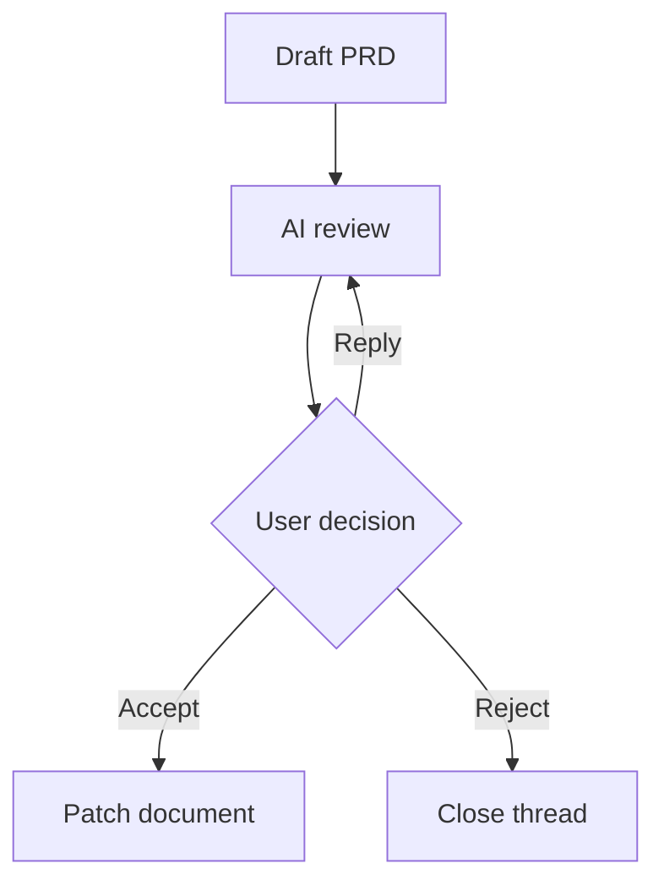

# AI Markdown Review Loop

AI Markdown Review Loop is a VS Code extension for reviewing Markdown documents with inline feedback, AI-ready review threads, and agent handoff exports.

The first MVP focuses on a local workflow:

- Open a rendered Markdown review preview.
- Open the review preview beside the Markdown source in a split editor.
- Render Mermaid diagrams from fenced `mermaid` code blocks.
- Open the review preview from a Markdown editor title shortcut.
- Use the green AI Review icon in the VS Code editor title toolbar.
- Drag-select rendered text and attach feedback from an inline comment popover.
- See saved comments as highlights and small badges in the rendered document.
- Click a highlighted region or badge to inspect, resolve, or reject saved comments.
- Click a thread in `Review Threads` to jump back to its highlighted content.
- Persist compact `ai-review-anchor` metadata in the Markdown file while storing full thread data in sidecar JSON.
- Attach feedback directly to a Mermaid diagram source block.
- Store review threads in a workspace-local sidecar file.
- Export unresolved feedback as Markdown for an AI coding agent.
- Run a local heuristic document review to seed obvious feedback items.

## Development

```bash
nvm use
npm install
npm run compile
```

To run inside VS Code:

1. Open this folder in VS Code.
2. Press `F5` to launch an Extension Development Host.
3. Open a `.md` file.
4. Click the review shortcut in the Markdown editor title, or run `AI Markdown Review: Open Review Preview`.

Installed usage:

1. Open a Markdown file.
2. Click the split-review icon in the editor title toolbar, right-click the editor and choose `AI Markdown Review: Open Review Beside`, or press `Cmd+Alt+Shift+R`.
3. Drag-select rendered text in the review preview.
4. Save feedback inline and the selected text will be highlighted with a comment badge.

## Commands

- `AI Markdown Review: Open Review Preview`
- `AI Markdown Review: Review Document`
- `AI Markdown Review: Export Feedback for Agent`

## Shortcuts

- Green editor title toolbar icon: open review preview.
- Split-review editor title toolbar icon: open Markdown source and review preview side by side.
- Editor context menu on Markdown files: open review preview or export feedback.
- Keyboard shortcut: `Cmd+Alt+R` on macOS, `Ctrl+Alt+R` elsewhere.
- Split keyboard shortcut: `Cmd+Alt+Shift+R` on macOS, `Ctrl+Alt+Shift+R` elsewhere.

## Mermaid

Mermaid diagrams render directly inside the review preview:

````md

````

Each diagram card includes:

- `Feedback` to attach review feedback to the diagram source.
- `Copy` to copy the Mermaid source.
- A collapsible `Source` view.
- Inline render errors with the original diagram source.
- A visible badge when the diagram has open feedback.

## Storage

MVP review data is stored under:

```text
.ai-markdown-review/
  documents/
    <document-hash>.json
```

Compact anchors are also inserted into the Markdown source:

```md
<!-- ai-review-anchor:{"id":"rv_...","status":"open","hash":"sha256:...","sidecar":".ai-markdown-review/documents/...json"} -->
```

The custom preview hides these anchors, but AI agents that read the Markdown can use them to connect document locations with sidecar review data.

## Packaging

```bash
npm run package
```

License policy and bundled dependency notices:

- [License Policy](./docs/LICENSE-POLICY.md)
- [Third-Party Notices](./THIRD_PARTY_NOTICES.md)

Publishing requires a Visual Studio Marketplace publisher and a `vsce` login:

```bash
npx vsce login <publisher-id>
npx vsce publish
```

GitHub publishing will use:

```bash
gh repo create uptown/ai-markdown-review-loop --public --source=. --remote=origin --push
```
