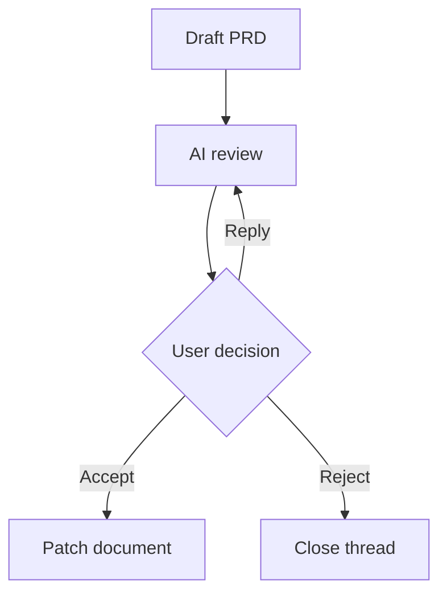

# AI Markdown Review Loop

AI Markdown Review Loop is a VS Code extension for reviewing Markdown documents with inline feedback, AI-ready review threads, and agent handoff exports.

The first MVP focuses on a local workflow:

- Open a rendered Markdown review preview.
- Render Mermaid diagrams from fenced `mermaid` code blocks.
- Select rendered text and attach feedback.
- Attach feedback directly to a Mermaid diagram source block.
- Store review threads in a workspace-local sidecar file.
- Export unresolved feedback as Markdown for an AI coding agent.
- Run a local heuristic document review to seed obvious feedback items.

## Development

```bash
nvm use
npm install
npm run compile
```

To run inside VS Code:

1. Open this folder in VS Code.
2. Press `F5` to launch an Extension Development Host.
3. Open a `.md` file.
4. Run `AI Markdown Review: Open Review Preview`.

## Commands

- `AI Markdown Review: Open Review Preview`
- `AI Markdown Review: Review Document`
- `AI Markdown Review: Export Feedback for Agent`

## Mermaid

Mermaid diagrams render directly inside the review preview:

````md

````

Each diagram card includes:

- `Feedback` to attach review feedback to the diagram source.
- `Copy` to copy the Mermaid source.
- A collapsible `Source` view.
- Inline render errors with the original diagram source.

## Storage

MVP review data is stored under:

```text
.ai-markdown-review/
  documents/
    <document-hash>.json
```

## Packaging

```bash
npm run package
```

Publishing requires a Visual Studio Marketplace publisher and a `vsce` login:

```bash
npx vsce login <publisher-id>
npx vsce publish
```

GitHub publishing will use:

```bash
gh repo create uptown/ai-markdown-review-loop --public --source=. --remote=origin --push
```
