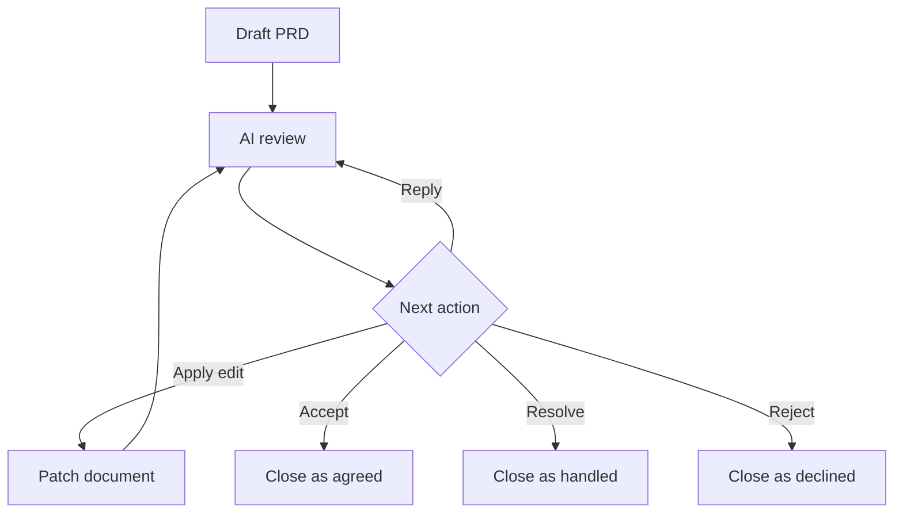

# AI Markdown Review Loop

AI Markdown Review Loop is a VS Code extension for reviewing Markdown documents with inline feedback, AI-ready review threads, and agent handoff exports.

The first MVP focuses on a local workflow:

- Open a rendered Markdown review preview.
- Open the review preview beside the Markdown source in a split editor.
- Render Mermaid diagrams from fenced `mermaid` code blocks.
- Open the review preview from a Markdown editor title shortcut.
- Use the green AI Review icon in the VS Code editor title toolbar.
- Drag-select rendered text and attach feedback from an inline comment popover.
- Submit comments and replies with `Enter`, while `Shift+Enter` keeps a newline.
- Empty comment composers close on outside click or Escape, while typed drafts stay open.
- Reply drafts inside the comment overlay also stay open until they are empty.
- See saved comments as highlights and small badges in the rendered document.
- Click a highlighted region or badge to inspect, accept, resolve, or reject saved comments.
- Edit or rewrite a rendered Markdown block through a constrained block editor that keeps review anchors in sync.
- Edit rendered Markdown tables through a grid editor with row, column, and alignment controls.
- Edit Mermaid diagram source from the rendered diagram card through the same review-aware edit pipeline.
- Reply under review comments with clear `You`/`AI` attribution for future AI handoff.
- Distinguish user comments from AI-generated review comments with separate labels, badges, and highlight colors.
- Apply suggested replacement patches from review threads when the patch still matches a reliable anchor.
- Use `Accept` for agreement, `Resolve` for handled issues, and `Reject` for declined recommendations. These close the review thread but do not automatically patch the Markdown.
- Click a thread in `Review Threads` to jump back to its highlighted content.
- Review accepted, resolved, and rejected history from `Review Threads`, including who closed the thread and whether the old anchor is still linked or now outdated.
- Restore a closed review thread when a decision needs to be reopened.
- Persist compact `ai-review-anchor` metadata in the Markdown file while storing full thread data in sidecar JSON.
- Keep review sidecars and inline metadata aligned when a reviewed Markdown file is renamed.
- Attach feedback directly to a Mermaid diagram source block.
- Store review threads in a hidden sidecar file beside each Markdown document.
- Export unresolved feedback as Markdown for an AI coding agent.
- Ship a repo-owned AI review policy and thread-creation schema for future AI reviewer integrations.
- Document the human-AI collaboration loop and first-pass context bootstrap path.
- Open a generic AI bootstrap prompt from the review preview so any AI agent can learn the review loop and preserve comments while editing Markdown.
- Run a local heuristic document review to seed obvious feedback items.

## Development

```bash
nvm use
npm install
npm run check
npm run compile
```

To run inside VS Code:

1. Open this folder in VS Code.
2. Press `F5` to launch an Extension Development Host.
3. Open a `.md` file.
4. Click the review shortcut in the Markdown editor title, or run `AI Markdown Review: Open Review Preview`.

Installed usage:

1. Open a Markdown file.
2. Click the split-review icon in the editor title toolbar, right-click the editor and choose `AI Markdown Review: Open Review Beside`, or press `Cmd+Alt+Shift+R`.
3. Drag-select rendered text in the review preview.
4. Save feedback inline and the selected text will be highlighted with a comment badge.
5. Reply under a review thread when you need to add discussion context before exporting feedback.
6. Use `Open Bootstrap Prompt` when an AI agent needs the repo's review-loop rules before reviewing or editing Markdown.

## Commands

- `AI Markdown Review: Open Review Preview`
- `AI Markdown Review: Review Document`
- `AI Markdown Review: Export Feedback for Agent`
- `AI Markdown Review: Open AI Context Bootstrap Prompt`

## Shortcuts

- Green editor title toolbar icon: open review preview.
- Split-review editor title toolbar icon: open Markdown source and review preview side by side.
- Editor context menu on Markdown files: open review preview, run local review, or export feedback.
- Keyboard shortcut: `Cmd+Alt+R` on macOS, `Ctrl+Alt+R` elsewhere.
- Split keyboard shortcut: `Cmd+Alt+Shift+R` on macOS, `Ctrl+Alt+Shift+R` elsewhere.

## Mermaid

Mermaid diagrams render directly inside the review preview:

````md

````

Each diagram card includes:

- `Edit` to update the Mermaid source block without leaving the review preview.
- `Feedback` to attach review feedback to the diagram source.
- `Copy` to copy the Mermaid source.
- A collapsible `Source` view.
- Inline render errors with the original diagram source.
- A visible badge when the diagram has open feedback.

## Storage

Review data is stored beside each Markdown document in one hidden JSON sidecar:

```text
docs/spec.md
docs/.spec.md.ai-review.json
```

The sidecar stores open threads and closed history together:

```json
{
  "schemaVersion": 2,
  "documentUri": "file:///workspace/docs/spec.md",
  "openThreads": [],
  "closedThreads": []
}
```

The extension still reads legacy workspace-root sidecars from `.ai-markdown-review/documents/` and `.ai-markdown-review/resolved/` so existing review state can migrate lazily on the next review write or rename.

One compact document-level anchor index is also inserted into the Markdown source:

```md
<!-- ai-review-anchors:{"sidecar":"docs/.spec.md.ai-review.json","ids":["rv_...","rv_..."]} -->
```

The custom preview hides these anchors, but AI agents that read the Markdown can use them to connect document locations with sidecar review data.

If the commented text changes and the original text snippet no longer matches, the preview falls back to sidecar context snippets and line hints so the review thread still appears near the edited block. When the preview finds the comment with high confidence, it refreshes the sidecar line hint after a short idle debounce for the next render. Thread cards show whether the anchor is `Located`, `Recovered`, `Approximate`, or `Needs re-anchor` so lost comments remain visible instead of silently disappearing. Approximate or missing matches are not auto-saved as new anchor locations.

If the sidecar JSON is deleted or no longer contains matching thread data, the review preview and feedback export warn that inline anchors are stale. The original comment text cannot be rebuilt from the inline anchors alone; restore the sidecar JSON from backup or use `Clean stale anchors` in the preview warning if the comments are no longer needed.

When several review threads exist in one document, the extension rewrites them into that single grouped `ai-review-anchors` metadata comment instead of adding one metadata line per thread.

Accepted, resolved, or rejected review threads move from `openThreads` to `closedThreads` inside the same sidecar. Their inline Markdown anchor metadata is removed so closed feedback does not leave stale `status:"open"` comments in the source, and a compact `ai-review-log` entry is appended at the end of the Markdown file as an audit pointer.

The preview keeps closed feedback visible under `Review Threads` as history. Closed cards use different decision colors for accepted, resolved, and rejected feedback, show who closed the thread when that metadata is available, and show whether the original anchor text is still `Linked` in the current Markdown or `Outdated` because the link target no longer appears. `Restore` reopens a closed thread, moves it back to `openThreads`, removes the closed audit pointer, and writes a fresh open anchor index.

## Agent Handoff

Feedback exports include open thread IDs, source labels, discussion history, anchor confidence, editing guidelines, commenting guidelines, and a future-facing thread-creation contract for AI agents. Agents are instructed to preserve review metadata, make localized edits, report each handled `rv_*` ID with an outcome, avoid closing review threads unless the user explicitly asks for an `accepted`, `resolved`, or `rejected` decision, and follow the repo policy when proposing new AI-authored review threads.

Canonical AI review contracts:

- [AI Review Policy](./docs/AI-REVIEW-POLICY.md)
- [AI Collaboration Loop](./docs/AI-COLLABORATION-LOOP.md)
- [AI Context Bootstrap](./docs/AI-CONTEXT-BOOTSTRAP.md)
- [AI Review Thread Schema](./docs/agent-review-thread.schema.json)

For first-time setup in a repo, the recommended context injection path is:

1. Use `AI Markdown Review: Open AI Context Bootstrap Prompt` or the preview's `Open Bootstrap Prompt` action.
2. Copy the opened document as-is into any AI agent. The generated document is the prompt itself, not a source-detection report or a template that needs cleanup.
3. Let the AI read the repo docs, use AI Markdown Review Loop when available, and preserve colocated `.ai-review.json` sidecars plus inline review metadata during Markdown edits.
4. Let the AI draft or refresh `docs/AI-CONTEXT-BRIEF.md` only when a durable context brief is useful; the bootstrap prompt is also the contract for immediate review and edit work.
5. Use replies on threads to refine or correct AI assumptions instead of starting over with a new prompt each time.

Suggested replacement patches are treated as document edits, not just review decisions. `Apply Edit` replaces the matching Markdown text, refreshes affected sidecar anchors and context snippets, records an edit outcome reply, and then closes the target thread as `accepted`; if the original text is missing, duplicated ambiguously, or attached to a low-confidence anchor, the extension leaves the thread open.

Rendered block edits use the same review-aware edit pipeline. The MVP editor is intentionally constrained to source-mapped Markdown blocks instead of replacing the whole file with a free-form WYSIWYG surface, so open comments can stay attached to the edited range and ordinary source edits still fall back to debounced re-anchoring.

Rendered Markdown tables get a dedicated grid editor instead of the generic block editor. Use `Edit Table` from the preview table controls to edit header/body cells, add or remove rows and columns, choose column alignment, and save back to pipe-table Markdown through the same review-aware edit and undo path.

Review-aware edits, new comment anchors, review decisions, and restored threads register sidecar snapshots with the Markdown edit. Undo and redo restore the matching `.ai-review.json` sidecar state when the Markdown text rolls backward or forward.

If a sidecar write fails during a review-aware change, the extension rolls the Markdown and sidecar files back together instead of leaving a half-applied review state behind.

## Packaging

```bash
npm run check
npm run package
```

`npm run check` runs TypeScript type checking plus Node-based regression tests for review export, suggested patch selection, review-aware edits, inline anchor metadata, and the review lifecycle scenario.

License policy and bundled dependency notices:

- [License Policy](./docs/LICENSE-POLICY.md)
- [Third-Party Notices](./THIRD_PARTY_NOTICES.md)

Publishing requires a Visual Studio Marketplace publisher and a `vsce` login:

```bash
npx vsce login <publisher-id>
npx vsce publish
```

GitHub publishing will use:

```bash
gh repo create uptown/ai-markdown-review-loop --public --source=. --remote=origin --push
```
