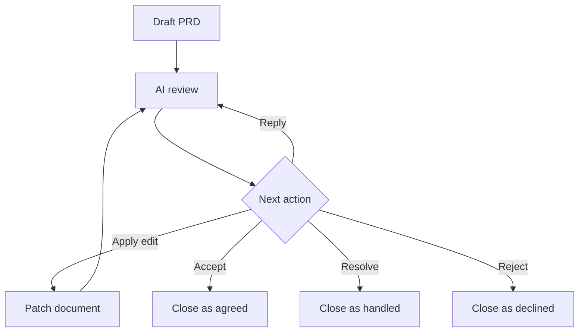

# AI Markdown Review Loop

AI Markdown Review Loop is a VS Code extension for reviewing Markdown documents with inline feedback, AI-ready review threads, and agent handoff exports.

The first MVP focuses on a local workflow:

- Open a rendered Markdown review preview.
- Open the review preview beside the Markdown source in a split editor.
- Render Mermaid diagrams from fenced `mermaid` code blocks.
- Open the review preview from a Markdown editor title shortcut.
- Use the green AI Review icon in the VS Code editor title toolbar.
- Drag-select rendered text and attach feedback from an inline comment popover.
- Submit comments and replies with `Enter`, while `Shift+Enter` keeps a newline.
- See saved comments as highlights and small badges in the rendered document.
- Click a highlighted region or badge to inspect, accept, resolve, or reject saved comments.
- Reply under review comments with clear `You`/`AI` attribution for future AI handoff.
- Distinguish user comments from AI-generated review comments with separate labels, badges, and highlight colors.
- Apply suggested replacement patches from review threads when the patch still matches a reliable anchor.
- Use `Accept` for agreement, `Resolve` for handled issues, and `Reject` for declined recommendations. These close the review thread but do not automatically patch the Markdown.
- Click a thread in `Review Threads` to jump back to its highlighted content.
- Persist compact `ai-review-anchor` metadata in the Markdown file while storing full thread data in sidecar JSON.
- Attach feedback directly to a Mermaid diagram source block.
- Store review threads in a workspace-local sidecar file.
- Export unresolved feedback as Markdown for an AI coding agent.
- Run a local heuristic document review to seed obvious feedback items.

## Development

```bash
nvm use
npm install
npm run check
npm run compile
```

To run inside VS Code:

1. Open this folder in VS Code.
2. Press `F5` to launch an Extension Development Host.
3. Open a `.md` file.
4. Click the review shortcut in the Markdown editor title, or run `AI Markdown Review: Open Review Preview`.

Installed usage:

1. Open a Markdown file.
2. Click the split-review icon in the editor title toolbar, right-click the editor and choose `AI Markdown Review: Open Review Beside`, or press `Cmd+Alt+Shift+R`.
3. Drag-select rendered text in the review preview.
4. Save feedback inline and the selected text will be highlighted with a comment badge.
5. Reply under a review thread when you need to add discussion context before exporting feedback.

## Commands

- `AI Markdown Review: Open Review Preview`
- `AI Markdown Review: Review Document`
- `AI Markdown Review: Export Feedback for Agent`

## Shortcuts

- Green editor title toolbar icon: open review preview.
- Split-review editor title toolbar icon: open Markdown source and review preview side by side.
- Editor context menu on Markdown files: open review preview, run local review, or export feedback.
- Keyboard shortcut: `Cmd+Alt+R` on macOS, `Ctrl+Alt+R` elsewhere.
- Split keyboard shortcut: `Cmd+Alt+Shift+R` on macOS, `Ctrl+Alt+Shift+R` elsewhere.

## Mermaid

Mermaid diagrams render directly inside the review preview:

````md

````

Each diagram card includes:

- `Feedback` to attach review feedback to the diagram source.
- `Copy` to copy the Mermaid source.
- A collapsible `Source` view.
- Inline render errors with the original diagram source.
- A visible badge when the diagram has open feedback.

## Storage

MVP review data is stored under:

```text
.ai-markdown-review/
  documents/
    <document-hash>.json
  resolved/
    <document-hash>.json
```

One compact document-level anchor index is also inserted into the Markdown source:

```md
<!-- ai-review-anchors:{"sidecar":".ai-markdown-review/documents/...json","ids":["rv_...","rv_..."]} -->
```

The custom preview hides these anchors, but AI agents that read the Markdown can use them to connect document locations with sidecar review data.

If the commented text changes and the original text snippet no longer matches, the preview falls back to sidecar context snippets and line hints so the review thread still appears near the edited block. When the preview finds the comment with high confidence, it refreshes the sidecar line hint after a short idle debounce for the next render. Thread cards show whether the anchor is `Located`, `Recovered`, `Approximate`, or `Needs re-anchor` so lost comments remain visible instead of silently disappearing. Approximate or missing matches are not auto-saved as new anchor locations.

If the sidecar JSON is deleted or no longer contains matching thread data, the review preview and feedback export warn that inline anchors are stale. The original comment text cannot be rebuilt from the inline anchors alone; restore the sidecar JSON from backup/source control or use `Clean stale anchors` in the preview warning if the comments are no longer needed.

When several review threads exist in one document, the extension rewrites them into that single grouped `ai-review-anchors` metadata comment instead of adding one metadata line per thread.

Accepted, resolved, or rejected review threads move from `documents/` to `resolved/`. Their inline Markdown anchor metadata is removed so closed feedback does not leave stale `status:"open"` comments in the source, and a compact `ai-review-log` entry is appended at the end of the Markdown file as an audit pointer.

## Agent Handoff

Feedback exports include open thread IDs, source labels, discussion history, anchor confidence, and editing guidelines for AI agents. Agents are instructed to preserve review metadata, make localized edits, report each handled `rv_*` ID with an outcome, and avoid closing review threads unless the user explicitly asks for an `accepted`, `resolved`, or `rejected` decision.

Suggested replacement patches are treated as document edits, not just review decisions. `Apply Edit` replaces the matching Markdown text and then closes the thread as `accepted`; if the original text is missing, duplicated ambiguously, or attached to a low-confidence anchor, the extension leaves the thread open.

## Packaging

```bash
npm run check
npm run package
```

License policy and bundled dependency notices:

- [License Policy](./docs/LICENSE-POLICY.md)
- [Third-Party Notices](./THIRD_PARTY_NOTICES.md)

Publishing requires a Visual Studio Marketplace publisher and a `vsce` login:

```bash
npx vsce login <publisher-id>
npx vsce publish
```

GitHub publishing will use:

```bash
gh repo create uptown/ai-markdown-review-loop --public --source=. --remote=origin --push
```
