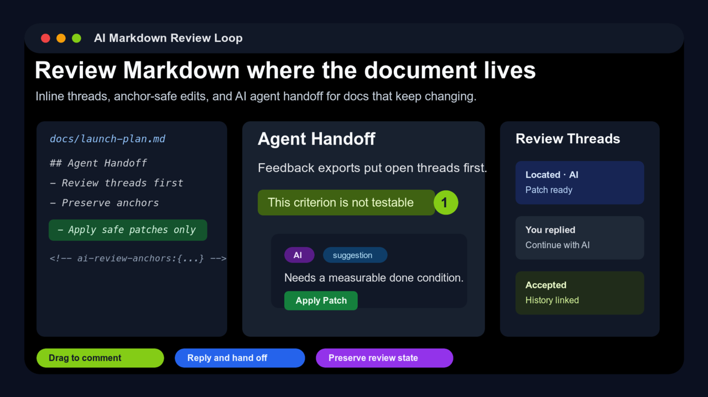
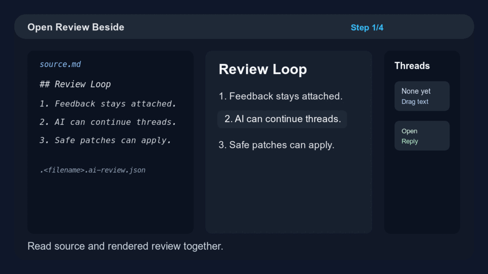
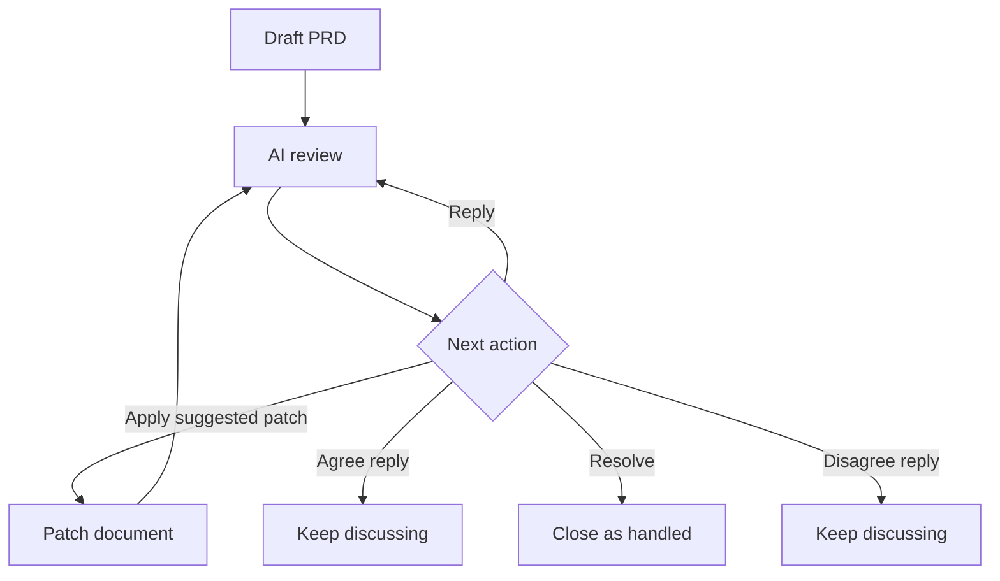

# AI Markdown Review Loop

Review Markdown like a PR inside VS Code: comment on rendered text, keep human
and AI review threads attached through edits, and export unresolved feedback
back to your coding agent.

Best for specs, PRDs, implementation plans, READMEs, ADRs, and AI-generated
docs that need review before implementation.





[Download the short MP4 demo](./media/review-loop-demo.mp4)

## How It Works

1. Open a Markdown file in the review preview, or open source and preview side by side.
2. Drag-select rendered text and leave anchored feedback.
3. Reply, resolve, close as declined, safely apply suggested patches, or export open threads to your AI agent.

AI Markdown Review Loop is local-first. It stores review state beside your
Markdown files and does not call a model provider by itself. AI collaboration
happens when you copy a generated prompt or feedback export into the agent you
choose.

## Highlights

- Rendered Markdown review preview with visible comment highlights and badges.
- Local Markdown images render inside the review preview with image-level feedback buttons and badges.
- Split review command for source and rendered preview side by side.
- Read-only comment overlays from highlighted regions or badges.
- Review thread replies with consistent `You` and `AI` attribution.
- Discussion-first shortcuts such as `Agree`, `Revise`, and `Disagree`.
- Explicit `Resolve`, `Close as Declined`, restore, and closed-history states.
- `Apply Patch and Close` for reliable suggested replacements that still match the document.
- Review-aware Markdown, table, and Mermaid edits that keep anchors and sidecars in sync.
- Anchor confidence states such as `Located`, `Recovered`, `Approximate`, and `Needs re-anchor`.
- Generic bootstrap and feedback-loop prompts for AI agents that need to preserve sidecar review state.
- Threads-first feedback export for agent handoff.

## Images

Local Markdown images render in the review preview through VS Code-safe webview
URIs, so images next to a spec can be reviewed without leaving the loop:

```md

```

Each rendered image can receive feedback from its `Feedback` button. Open image
threads show the same badges, overlays, replies, history, and agent export
behavior as text, table, and Mermaid feedback. Remote `http` and `https` images
are not loaded automatically; the preview shows a reviewable placeholder with an
external link instead.

## Install And Use

Installed usage:

1. Open a Markdown file.
2. Click the split-review icon in the editor title toolbar, right-click the editor and choose `AI Markdown Review: Open Review Beside`, or press `Cmd+Alt+Shift+R`.
3. Drag-select rendered text in the review preview.
4. Save feedback inline and the selected text will be highlighted with a comment badge.
5. Reply under a review thread when you need to add discussion context before exporting feedback.
6. Use `Open Bootstrap Prompt` when an AI agent needs the repo's review-loop rules before reviewing or editing Markdown.
7. Use `Open Feedback Loop Prompt` when an AI agent should continue existing threads, replies, and suggested edits.

## Commands

- `AI Markdown Review: Open Review Beside`
- `AI Markdown Review: Open Review Preview`
- `AI Markdown Review: Review Document`
- `AI Markdown Review: Export Feedback for Agent`
- `AI Markdown Review: Open AI Context Bootstrap Prompt`
- `AI Markdown Review: Open AI Feedback Loop Prompt`

## Shortcuts

- Green editor title toolbar icon: open review preview.
- Split-review editor title toolbar icon: open Markdown source and review preview side by side.
- Editor context menu on Markdown files: open review preview, run local review, or export feedback.
- Keyboard shortcut: `Cmd+Alt+R` on macOS, `Ctrl+Alt+R` elsewhere.
- Split keyboard shortcut: `Cmd+Alt+Shift+R` on macOS, `Ctrl+Alt+Shift+R` elsewhere.

## Mermaid

Mermaid diagrams render directly inside the review preview:

````md

````

Each diagram card includes:

- `Edit` to update the Mermaid source block without leaving the review preview.
- `Feedback` to attach review feedback to the diagram source.
- `Copy` to copy the Mermaid source.
- A collapsible `Source` view.
- Inline render errors with the original diagram source.
- A visible badge when the diagram has open feedback.

## Storage

Review data is stored beside each Markdown document in one hidden JSON sidecar:

```text
docs/spec.md
docs/.spec.md.ai-review.json
```

The sidecar stores open threads and closed history together:

```json
{
  "schemaVersion": 2,
  "documentUri": "file:///workspace/docs/spec.md",
  "openThreads": [],
  "closedThreads": []
}
```

The extension finds review state by convention: for `docs/spec.md`, the canonical sidecar is `docs/.spec.md.ai-review.json`. New comments, replies, status decisions, and restore actions update that sidecar without inserting review metadata into the Markdown source. The extension still reads legacy workspace-root sidecars from `.ai-markdown-review/documents/` and `.ai-markdown-review/resolved/` so existing review state can migrate lazily on the next review write or rename.

If the commented text changes and the original text snippet no longer matches, the preview falls back to sidecar context snippets and line hints so the review thread still appears near the edited block. When the preview finds the comment with high confidence, it refreshes the sidecar line hint after a short idle debounce for the next render. Thread cards show whether the anchor is `Located`, `Recovered`, `Approximate`, or `Needs re-anchor` so lost comments remain visible instead of silently disappearing. Review-aware edits also add outcome chips such as `Kept` or `Patch applied` when a thread was updated by the edit pipeline. Approximate or missing matches are not auto-saved as new anchor locations.

If an older Markdown file already contains legacy `ai-review-anchor`, `ai-review-anchors`, or `ai-review-log` comments, the custom preview hides them and can clean that legacy metadata on request. Those inline comments are treated as legacy recovery hints, not the source of truth for new review state.

Accepted, resolved, or rejected review threads move from `openThreads` to `closedThreads` inside the same sidecar. The preview keeps closed feedback visible under `Review Threads` as history. Closed cards use different decision colors for accepted, resolved, and rejected feedback, show who closed the thread when that metadata is available, and show whether the original anchor text is still `Linked` in the current Markdown or `Outdated` because the link target no longer appears. `Restore` reopens a closed thread, moves it back to `openThreads`, and focuses the restored thread without writing new Markdown metadata.

Open thread actions are intentionally discussion-first. The reply shortcuts adapt to the thread type: questions offer answer/clarify/not-applicable drafts, risks offer acknowledge/mitigate/challenge drafts, and fixes or suggestions offer agree/revise/disagree drafts. These shortcuts prefill a reply instead of closing the thread. Weak replies like `ok` show agent-handoff warnings because they can poison the next AI turn. `Continue with AI` opens a feedback-loop prompt focused on that exact `rv_*` thread. `Resolve` closes a thread after the issue is handled or no longer applies, while `Close as Declined` closes feedback that is wrong or intentionally not applicable. For threads with a reliable suggested replacement, `Apply Patch and Close` is the action that changes Markdown, refreshes anchors, records an edit outcome reply, and closes the thread as `accepted`.

## Agent Handoff

Feedback exports put open review threads first, followed by source labels, discussion history, anchor confidence, editing guidelines, commenting guidelines, and a future-facing thread-creation contract for AI agents. Agents are instructed to preserve colocated sidecars, make localized edits, report each handled `rv_*` ID with an outcome, avoid closing review threads unless the user explicitly asks for an `accepted`, `resolved`, or `rejected` decision, and follow the repo policy when proposing new AI-authored review threads.

AI prompts and exports also treat the latest human request and thread replies as a review session brief. If the user says this pass is about product/agent handoff rather than grammar, the next AI turn should prioritize handoff issues and avoid generic prose comments.

Canonical AI review contracts:

- [AI Review Policy](./docs/AI-REVIEW-POLICY.md)
- [AI Collaboration Loop](./docs/AI-COLLABORATION-LOOP.md)
- [AI Context Bootstrap](./docs/AI-CONTEXT-BOOTSTRAP.md)
- [AI Review Thread Schema](./docs/agent-review-thread.schema.json)

For first-time setup in a repo, the recommended context injection path is:

1. Use `AI Markdown Review: Open AI Context Bootstrap Prompt` or the preview's `Open Bootstrap Prompt` action.
2. Copy the opened document as-is into any AI agent. The generated document is the prompt itself, not a source-detection report or a template that needs cleanup.
3. Tell the AI which Markdown file to review or edit in the same conversation, or let it ask if the target is unclear. The bootstrap prompt stays generic and does not embed a generated target line.
4. Let the AI discover only the repo context needed for the requested review or edit, use AI Markdown Review Loop when available, and preserve colocated `.ai-review.json` sidecars during Markdown edits.
5. Treat durable context briefs as optional artifacts that the AI creates or refreshes only when the human asks for that.
6. Use replies on threads to refine or correct AI assumptions instead of starting over with a new prompt each time.

For active review iteration after bootstrap:

1. Use `AI Markdown Review: Open AI Feedback Loop Prompt`, the preview's global `Open Feedback Loop Prompt` action, or a thread's `Continue with AI` action.
2. Copy the opened document into the AI agent that should continue the loop.
3. Let the AI inspect open Review Threads, answer or challenge existing replies, and apply suggested patches only when explicitly requested.
4. Require the AI to report every touched `rv_*` thread as replied, applied patch, edited nearby, preserved, stale, blocked, resolved by human request, or needing a human decision.

Suggested replacement patches are treated as document edits, not just review decisions. `Apply Patch and Close` replaces the matching Markdown text, refreshes affected sidecar anchors and context snippets, records an edit outcome reply, and then closes the target thread as `accepted`. The preview shows why a patch is safe before enabling that action; if the original text is missing, duplicated ambiguously, or attached to a low-confidence anchor, the extension leaves the thread open.

When AI revises a patch in discussion, the feedback-loop prompt asks it to use a `Suggested patch revision:` label with a fenced `diff` block. That keeps revised patch candidates readable to humans without treating every reply as an immediately applyable edit.

Rendered block edits use the same review-aware edit pipeline. The editor is intentionally constrained to source-mapped Markdown blocks instead of replacing the whole file with a free-form WYSIWYG surface, so open comments can stay attached to the edited range and ordinary source edits still fall back to debounced re-anchoring.

Rendered Markdown tables get a dedicated grid editor instead of the generic block editor. Use `Edit Table` from the preview table controls to edit header/body cells, add or remove rows and columns, choose column alignment, and save back to pipe-table Markdown through the same review-aware edit and undo path.

Review-aware Markdown edits register sidecar snapshots with the text edit. Undo and redo restore the matching `.ai-review.json` sidecar state when the Markdown text rolls backward or forward.

If a sidecar write fails during a review-aware change, the extension rolls the Markdown and sidecar files back together instead of leaving a half-applied review state behind.

## Privacy And Storage

- Review data stays in your workspace in hidden `.<filename>.ai-review.json` sidecars.
- New comments, replies, decisions, and restore actions do not write inline metadata into the Markdown source.
- Existing inline `ai-review-*` comments are treated as legacy cleanup hints, not the source of truth.
- The extension does not send document text to an AI provider.
- Export and prompt commands produce Markdown you can inspect before giving it to an agent.

## License And Notices

AI Markdown Review Loop is MIT licensed. Bundled runtime dependency notices are
kept in the repository and packaged with the extension:

- [License Policy](./docs/LICENSE-POLICY.md)
- [Third-Party Notices](./THIRD_PARTY_NOTICES.md)

## Support

Open issues at <https://github.com/uptown/ai-markdown-review-loop/issues>.
