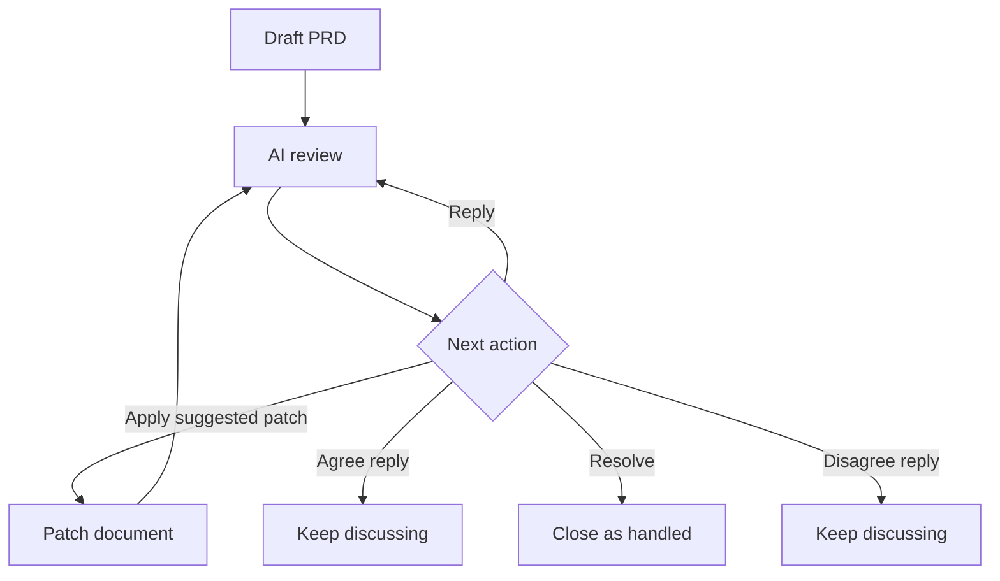

# Mermaid Review Sample

This file is a quick manual smoke test for the review preview.

Review target:

- Select this sentence and add a useful text comment.
- Try a too-short comment first to see the handoff quality warning.
- Use the diagram card Feedback button to attach feedback to the Mermaid source.
