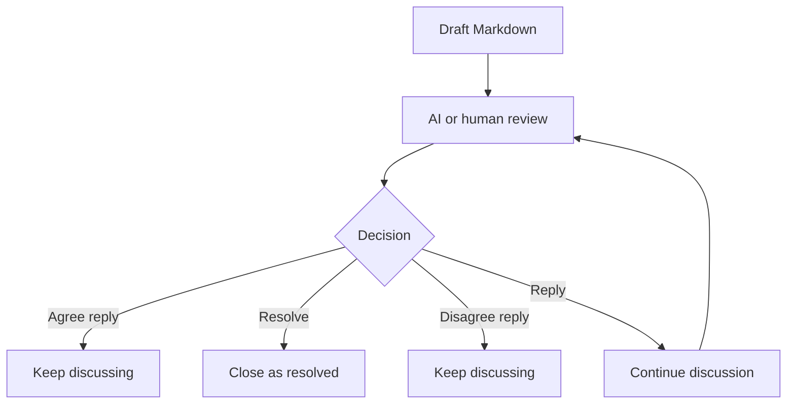
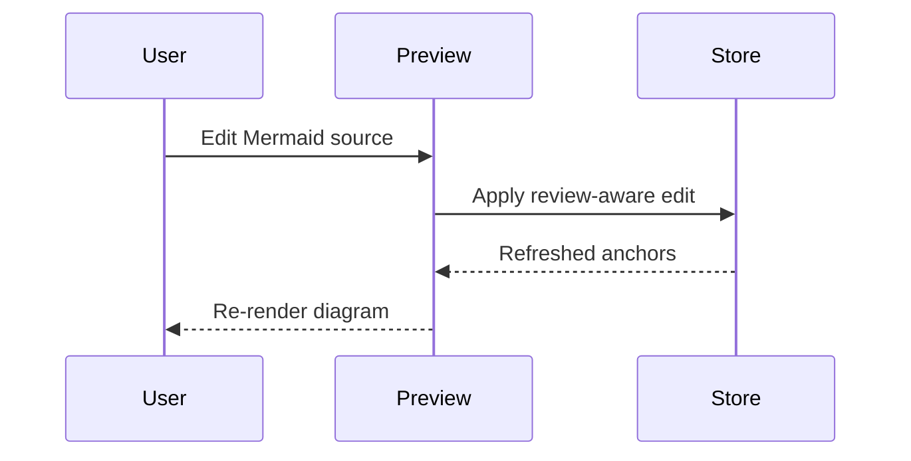

# Complex Review Sample

This document is a manual stress sample for AI Markdown Review Loop. It mixes prose, repeated phrases, tables, Mermaid diagrams, lists, blockquotes, code fences, and intentionally review-worthy text.

## Review Targets

Select this phrase only: rollback steps. Then edit the paragraph below and confirm the comment does not expand to the whole paragraph.

The release owner must document rollback steps before launch, but the exact approval path is TBD and the recovery owner is not named.

Repeat target one: the policy owner must approve the rollout.

Repeat target two: the policy owner must approve the rollout.

## Decision Table

This table is intentionally complex enough to exercise rendered table editing. Rendered table cells are reviewable, and the table-level Edit Table action should open a grid editor without dropping following Markdown.

| Area | Current decision | Risk | Owner | Status |
| --- | --- | --- | --- | --- |
| Auth | Use existing workspace identity | Token refresh behavior is not specified | Platform | Open |
| Review data | Colocated sidecar JSON | Deleted sidecar leaves review state unavailable | Extension | Mitigated |
| Mermaid | Render and source-edit fenced diagrams | Invalid syntax should show inline errors | Extension | Open |
| Tables | Reviewable rendered table with grid editing | Grid edits should preserve comments and following blocks | Extension | Open |
| Export | Open feedback only | Closed history may still be needed for audit | Product | Watching |

| Check | Expected result | Notes |
| :--- | :---: | ---: |
| Escaped pipe | `a \| b` remains visible | Markdown parser should not split it |
| Inline code | `npm run check` | Should stay monospace |
| Link | [Repository](https://github.com/uptown/ai-markdown-review-loop) | Avoid leaking query params |
| HTML break | First line<br>Second line | Useful for dense cells |

## Mermaid Flow



## Mermaid Sequence



## Lists And Quotes

1. First numbered item with a short review target.
2. Second numbered item with nested context:
   - Nested bullet A has a TODO marker.
   - Nested bullet B has a duplicated owner phrase.
3. Third numbered item should remain after editing item two.

> This blockquote should be commentable. If rewritten, comments on a short phrase inside it should not turn into comments on the whole quote.

## Code Fence

```ts
type ReviewStatus = 'open' | 'accepted' | 'resolved' | 'rejected';

export function shouldStayUneditedByRenderedBlockEditor(status: ReviewStatus): boolean {
  return status !== 'open';
}
```

## Long Paragraph

This paragraph is deliberately long so selection popovers, overlays, and anchor relocation can be tested with text that wraps on narrow screens. The comment overlay should appear near the highlighted region, the thread card should focus without jumping to unrelated content, and an edit to a nearby sentence should preserve any comment that still has a matching selected phrase.

## Task List

- [ ] Verify rendered table grid edits preserve comments and following blocks.
- [ ] Verify stale anchors can be cleaned safely.
- [ ] Confirm closed history can restore an outdated thread.
- [ ] Confirm Mermaid source edits do not delete the following paragraph.

## Final Paragraph

This final paragraph must survive edits to every section above.
