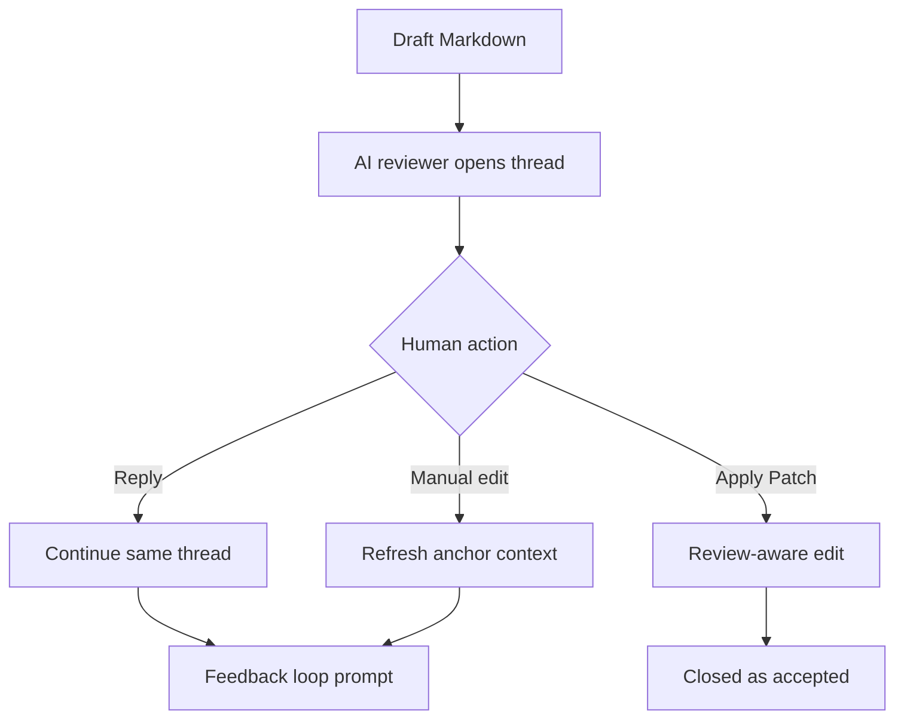
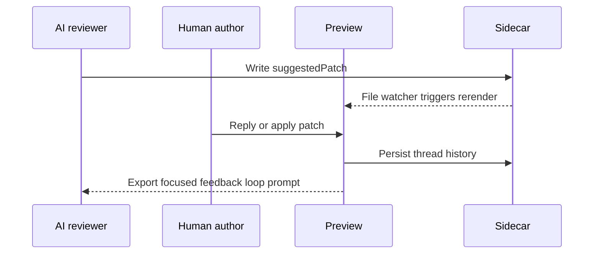

# Rich Review Loop Sample

This fixture is intentionally dense. It is meant to exercise AI Markdown Review Loop with realistic review comments, replies, suggested patches, table edits, Mermaid source edits, stale patch recovery, and anchor preservation after nearby document changes.

## Release Goal

The review workflow should let a writer accept useful AI feedback, challenge weak feedback, and continue the same thread without losing the comment location.

Success means comments stay attached during normal edits, suggested patches apply only when the target is safe, and an AI agent can continue from the exported thread history without asking the same question again.

## Acceptance Criteria

1. A reviewer can comment on the exact phrase `rollback owner` and the comment remains narrow if the surrounding sentence changes.
2. An AI suggested patch that no longer matches the source is shown as stale rather than as an applyable green button.
3. A human can disagree with a suggestion, and the AI can reply with a revised patch inside the same thread.
4. A table cell comment remains attached to its row and column after a grid edit.
5. A Mermaid source comment survives a diagram-source edit.
6. Closed history distinguishes patch-applied, resolved, and rejected outcomes.

## Product Narrative

The author wants a calm review surface. The AI reviewer should act like a collaborator, not a batch linter. When the author says "accept this suggestion", the system should treat it as an apply request only if the suggested patch still has one reliable target.

The repeated phrase appears twice: the policy owner must approve the launch.

The repeated phrase appears again: the policy owner must approve the launch.

## Review Matrix

| Area | Current text | Review risk | Owner | Expected action |
| --- | --- | --- | --- | --- |
| Rollback | The rollback owner is TBD. | Missing owner blocks launch readiness. | Release | Add owner or explicit decision date |
| Sidecar refresh | AI updates the suggested patch in the sidecar. | Preview can show stale button state. | Extension | Rerender without manual refresh |
| Table comments | Grid edits keep cell comments. | Row movement can detach anchors. | Extension | Preserve cell identity |
| Mermaid | Diagram source is editable. | Source edits can delete following content. | Extension | Edit only fenced block |
| Export | Threads-first export guides agents. | Vague replies can weaken handoff. | Product | Warn before handoff |

| Scenario | AI comment | Human reply | Expected loop outcome |
| :--- | :--- | :--- | :--- |
| Safe patch | "Make this acceptance criterion testable." | "accept this suggestion" | Apply patch and close as accepted |
| Stale patch | "Replace this sentence." | "I edited that sentence already." | Keep open and request revised patch |
| Disagreement | "Remove this policy section." | "This is required by launch policy." | AI revises in the same thread |
| Table edit | "Owner column is ambiguous." | "Use Release as owner." | Keep the cell-level comment attached |

## Mermaid Flow



## Mermaid Sequence



## Nested Lists

1. Draft review policy.
   1. Require AI comments to explain why the issue matters.
   2. Require suggested patches to have one exact target.
2. Simulate a disagreement.
   - Human says the proposed deletion is unsafe.
   - AI revises the same thread instead of opening a duplicate.
3. Apply a safe patch.
   - The extension updates Markdown and sidecar state together.
   - Undo should restore both the Markdown and review state.

## Task List

- [ ] Open the review preview beside this fixture.
- [ ] Add a comment to `rollback owner`.
- [ ] Edit the surrounding sentence and confirm the anchor stays narrow.
- [ ] Simulate a stale suggested patch by changing the original text first.
- [ ] Confirm the overlay shows a stale-patch explanation without manual refresh.

## Blockquote

> This quoted decision is deliberately reviewable. A comment on `quoted decision` should stay visible even if the surrounding quote is rewritten.

## Code Fence

```ts
type ReviewDecision = 'accepted' | 'resolved' | 'rejected';

export function canCloseThread(decision: ReviewDecision, explicitHumanIntent: boolean): boolean {
  return explicitHumanIntent && decision !== 'rejected';
}
```

## Long Wrapping Paragraph

This paragraph is long enough to wrap in a narrow preview. It contains the phrase anchor visibility so the overlay placement, active thread focus, and automatic sidecar refresh can be checked without relying on a tiny one-line paragraph.

## Final Guard

This final paragraph must remain present after every rendered block edit, table edit, Mermaid edit, and suggested patch simulation.
